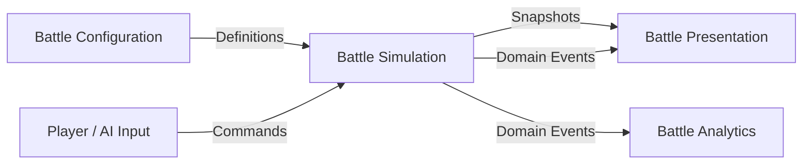
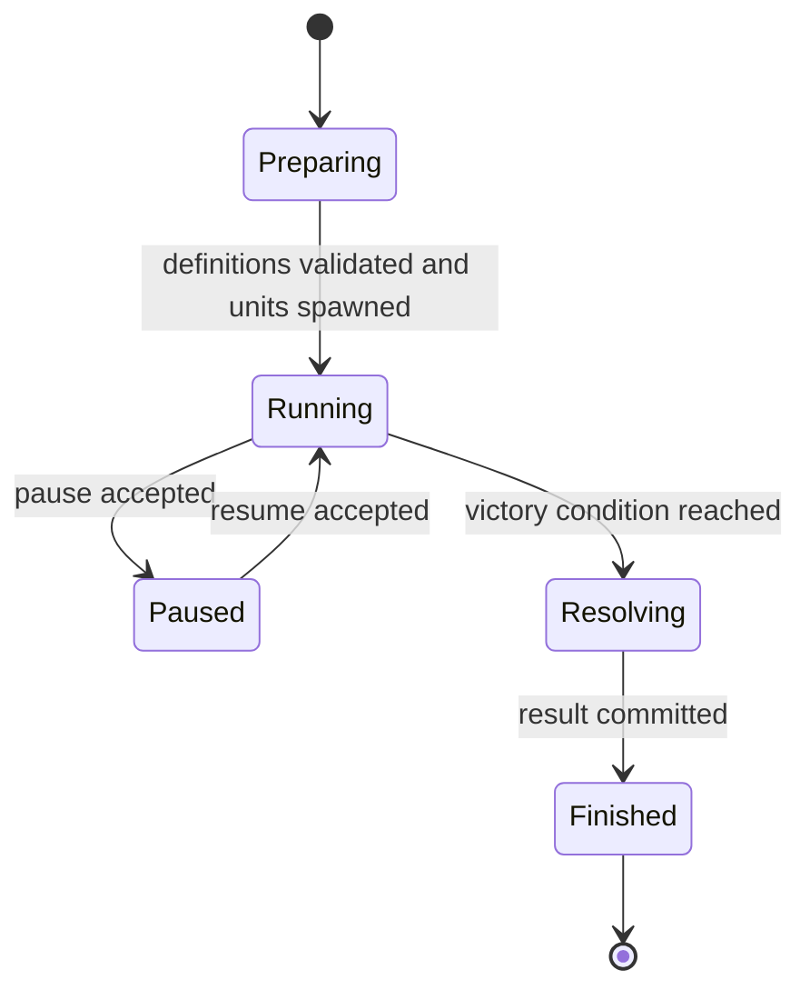

# 第一阶段 Domain 设计

## 1. 文档目的

本文档补充 `design/program_design_phase1.md`，定义第一阶段战斗程序的领域边界、核心对象、状态规则、命令、事件和系统协作方式。

Domain 层的目标是让战斗规则可以脱离 Godot 场景树运行，从而支持：

- 公式和状态规则自动测试。
- 无画面批量战斗模拟。
- 表现层替换而不改变战斗结果。
- 后续加入航空、潜艇、阵型和新战斗模式时复用现有规则。
- 将来需要回放、确定性调试或联机时保留演进空间。

本文所称 Domain，不要求实现完整的企业级 DDD。第一阶段采用轻量领域模型：明确状态所有权和业务规则，同时避免仓储框架、依赖注入容器、通用消息中间件等不必要设施。

相关文档：

- `design/program_design_phase1.md`
- `docs/core_mechanics.md`
- `docs/data_schema.md`
- `docs/combat_formula.md`
- `docs/balance_baseline.md`

---

## 2. 领域边界

### 2.1 核心域：Battle Simulation

第一阶段的核心域是单场战斗模拟，负责：

- 战斗生命周期。
- 舰队和旗舰状态。
- 单位移动意图与战场位置。
- 侦查与阵营共享视野。
- 目标选择和攻击授权。
- 武器装填、发射和投射物命中。
- 技能释放和状态效果。
- 伤害、沉没和胜负结算。
- 可用于复盘的领域事件和统计事实。

核心域不负责：

- 图片、动画、粒子、音效和镜头。
- 鼠标、键盘或触摸输入解析。
- JSON 文件读取和 Godot Resource 导入。
- UI 选择状态和界面布局。
- 角色养成、抽卡、装备更换和长期存档。

### 2.2 支撑域

第一阶段包含三个支撑域：

| 支撑域 | 职责 | 不应承担 |
| --- | --- | --- |
| Battle Configuration | 将角色、武器、技能、投射物和关卡配置转换为经过验证的定义对象 | 修改战斗中的运行时状态 |
| Battle Presentation | 将领域快照和事件转换为 Godot 节点、动画、VFX、音效和 HUD | 决定命中、伤害或胜负 |
| Battle Analytics | 消费领域事件，生成战斗统计和调参报告 | 反向修改战斗结果 |

### 2.3 上下文关系



依赖方向必须指向 Domain。Domain 不引用 Godot 场景、图片路径、UI 控件或统计输出格式。

---

## 3. 分层与目录

建议在现有 `scripts/` 下增加明确分层：

```text
scripts/
  domain/
    battle/
      battle_state.gd
      battle_rules.gd
      battle_result.gd
    fleets/
      fleet_state.gd
      faction_id.gd
    units/
      unit_state.gd
      unit_stats.gd
      movement_state.gd
      targeting_state.gd
    weapons/
      weapon_state.gd
      cooldown_group_state.gd
      attack_request.gd
      damage_result.gd
    projectiles/
      projectile_state.gd
    skills/
      skill_state.gd
      effect_spec.gd
    detection/
      contact_state.gd
      visibility_state.gd
    status/
      status_effect.gd
      stat_modifier.gd
    commands/
      battle_command.gd
    events/
      battle_event.gd
    services/
      detection_service.gd
      targeting_service.gd
      weapon_service.gd
      collision_service.gd
      damage_service.gd
      modifier_service.gd
      victory_service.gd

  application/
    battle_session.gd
    command_dispatcher.gd
    simulation_clock.gd
    battle_snapshot.gd

  infrastructure/
    data/
      json_config_loader.gd
      config_validator.gd
      definition_registry.gd
    analytics/
      battle_recorder.gd
    random/
      seeded_random_source.gd

  presentation/
    battle/
      battle_controller.gd
      ship_unit_view.gd
      projectile_view.gd
    ui/
      battle_hud.gd
```

目录表达依赖方向，不要求每个对象都单独建立脚本。简单值对象可以按内聚性合并，但不得把 Domain 类放回具体场景脚本中。

### 3.1 各层职责

**Domain**

- 保存战斗真状态。
- 执行不变量和公式。
- 接受已经标准化的领域命令。
- 产生领域事件。
- 不继承 `Node`，优先使用 `RefCounted` 或纯数据对象。

**Application**

- 组织一场战斗的用例和执行顺序。
- 将玩家、AI 和系统请求送入 Domain。
- 管理固定步长、命令队列、快照和事件发布。
- 不复制领域公式。

**Infrastructure**

- 读取 JSON、建立定义注册表。
- 提供可注入随机数源。
- 保存统计和调试输出。
- 实现 Domain 所需的外部适配。

**Presentation**

- 使用 Godot 节点显示领域状态。
- 将输入转换为 Application 命令。
- 根据事件播放一次性反馈。
- 不直接修改领域对象内部字段。

---

## 4. 定义数据与运行时状态

必须严格区分 Definition 和 State。

### 4.1 Definition

Definition 来源于 `data/` JSON，加载后只读，在多场战斗间复用。

主要类型：

- `ShipDefinition`
- `WeaponDefinition`
- `ProjectileDefinition`
- `SkillDefinition`
- `FormulaDefinition`
- `LevelDefinition`
- `AIProfileDefinition`

Definition 只描述初始能力和引用关系，不包含当前生命、剩余冷却、当前位置或当前目标。

### 4.2 State

State 只属于一场具体战斗，可以随模拟过程变化。

主要类型：

- `BattleState`
- `FleetState`
- `UnitState`
- `WeaponState`
- `SkillState`
- `ProjectileState`
- `ContactState`
- `StatusEffect`

创建战斗时，由 Definition 生成全新的 State。不得直接在 Definition 上扣血、写冷却或缓存当前目标。

### 4.3 标识规则

使用两类 ID：

- `definition_id`：稳定内容 ID，例如 `ship.warspite`、`weapon.381mm_ap`。
- `entity_id`：单场战斗内唯一 ID，例如 `unit.player.001`、`projectile.000143`。

领域引用一律使用 ID，不长期持有 Godot Node 引用。实体沉没或销毁后，旧 ID 查询应返回不存在，而不是保留悬空对象。

---

## 5. 聚合与状态所有权

### 5.1 BattleState 作为战斗聚合根

`BattleState` 是单场战斗的唯一聚合根，拥有：

```text
battle_id
phase
elapsed_time
tick_index
level_definition_id
fleets_by_id
units_by_id
projectiles_by_id
contacts_by_faction
pending_events
result
```

所有会改变战斗真状态的操作必须通过 `BattleSession` 调用领域行为，不能由 UI、场景节点或统计模块直接改字典。

第一阶段单位最多 6 个、投射物规模有限，使用单聚合足够简单。后续若大规模战斗产生性能问题，可以拆分存储和更新系统，但 `BattleState` 仍然是逻辑上的一致性边界。

### 5.2 FleetState

`FleetState` 拥有一方舰队级状态：

```text
fleet_id
faction_id
unit_ids
flagship_unit_id
initial_max_hp_total
shared_contacts
```

不变量：

- 每支参战舰队必须且只能有一名旗舰。
- 旗舰必须属于该舰队。
- `initial_max_hp_total` 在开战后不可改变。
- 沉没单位仍保留在 `unit_ids` 中，直到战斗结束，以便统计和超时结算。

### 5.3 UnitState

`UnitState` 是舰娘在战斗中的运行时实体：

```text
entity_id
definition_id
fleet_id
life_state
base_stats
runtime_stats
position
heading
velocity
movement_state
targeting_state
weapon_states
skill_state
status_effects
last_fire_time
```

不变量：

- `current_hp` 始终位于 `0..max_hp`。
- HP 到 0 后只能从 `Alive` 进入 `Sunk`，不能在第一阶段复活。
- `Sunk` 单位不能移动、开火、释放技能或成为普通攻击的新目标。
- 单位只能使用自己 Definition 声明的武器和技能。
- 运行时属性由基础值和状态效果计算，不直接永久改写基础属性。

### 5.4 WeaponState

每个装备底座配置生成一个 `WeaponState`：

```text
instance_id
definition_id
owner_unit_id
reload_remaining
cooldown_group_id
current_target_id
aim_heading
fire_sequence_index
enabled
```

不变量：

- `reload_remaining >= 0`。
- 武器只有在单位存活、启用、装填完成、目标合法且满足射程/射角时才能开火。
- 同一 `shared_cooldown_group` 在同一模拟时刻最多允许一种模式开火。
- 武器发射后只创建攻击或投射物事实，不直接修改目标 HP。

### 5.5 ProjectileState

鱼雷和需要领域级飞行过程的攻击使用 `ProjectileState`：

```text
entity_id
definition_id
source_unit_id
source_weapon_id
fleet_id
position
heading
speed
remaining_lifetime
remaining_pierce_count
active
```

火炮若第一阶段只需要落点和飞行延迟，可以表示为定时 `AttackRequest`，不强制创建参与碰撞的炮弹实体。鱼雷必须创建领域投射物，以保证碰撞与画面表现共享同一位置事实。

### 5.6 SkillState

```text
definition_id
owner_unit_id
cooldown_remaining
cast_state
pending_target
```

不变量：

- 冷却从开局开始计时。
- 沉没单位不能释放技能。
- 目标必须符合技能目标类型、阵营、可见性和释放距离。
- 释放成功后才进入冷却；取消目标选择不消耗冷却。

---

## 6. 值对象

值对象按值比较，不拥有独立生命周期。

### 6.1 基础值对象

| 类型 | 内容 | 规则 |
| --- | --- | --- |
| `BattleTime` | 秒或固定 Tick | 不为负数 |
| `WorldPosition` | `x, y` | Domain 不依赖 Node2D |
| `Heading` | 标准化角度 | 始终规范到统一范围 |
| `Distance` | 世界距离 | 不为负数 |
| `HitPoints` | 当前值和最大值 | 当前值不超过最大值 |
| `RangeBand` | 最小和最大射程 | 最小值不大于最大值 |
| `FireArc` | 中心角和宽度 | 宽度位于合法范围 |
| `CollisionCircle` | 中心位置和半径 | 半径大于 0 |
| `TargetRef` | 目标实体或区域位置 | 类型必须与命令匹配 |

第一阶段可以在 Domain 内使用 `Vector2` 进行纯数学运算，因为它是 Godot 的值类型；但领域接口不得要求调用场景树、物理节点或相机。

### 6.2 UnitStats

`UnitStats` 表示经过状态结算后的属性快照：

```text
max_hp
armor
armor_thickness
speed
turn_speed
detection_range
concealment_distance
fire_concealment_multiplier
evasion
gunnery_power
torpedo_power
anti_air_power
aviation_power
```

`base_stats` 来自 Definition。`runtime_stats` 由 `ModifierService` 根据当前状态效果计算。状态变化后标记脏位，按需重算，不允许不同系统各自实现一套属性叠加。

### 6.3 DamageResult

伤害结算返回不可变结果：

```text
attack_id
source_unit_id
target_unit_id
damage_type
hit
hit_reason
raw_damage
armor_modifier
armor_reduction
final_damage
target_hp_before
target_hp_after
caused_sinking
```

表现层根据 `DamageResult` 决定显示未命中、跳弹、0 伤害或有效伤害，但不能修改其中数值。

### 6.4 AttackRequest

`AttackRequest` 表示一次已经获准、等待命中或伤害结算的攻击：

```text
attack_id
source_unit_id
source_weapon_id
damage_type
target_ref
origin
issued_at_tick
resolve_at_tick
accuracy_modifier
damage_modifiers
```

火炮可以使用 `resolve_at_tick` 表达飞行时间；鱼雷在领域碰撞发生后创建对应请求。请求保存发射时已经确定的攻击来源和必要修正，目标防御属性在实际结算时读取，避免表现延迟改变发射事实。

---

## 7. 领域命令

命令表示希望战斗执行的意图。命令可以被拒绝，不等于已经发生的事实。

### 7.1 命令结构

所有命令包含：

```text
command_id
issued_at_tick
issuer_type
issuer_id
```

第一阶段命令：

| 命令 | 关键字段 | 发起方 |
| --- | --- | --- |
| `StartBattleCommand` | 关卡与双方舰队 | 系统 |
| `MoveUnitsCommand` | 单位 ID、目标位置 | 玩家或 AI |
| `FocusTargetCommand` | 单位 ID、敌方目标 ID | 玩家或 AI |
| `ClearFocusTargetCommand` | 单位 ID | 玩家或 AI |
| `CastSkillCommand` | 单位 ID、技能 ID、目标引用 | 玩家或 AI |
| `CancelSkillTargetingCommand` | 单位 ID | 玩家 |
| `PauseBattleCommand` | 无 | 玩家或系统 |
| `ResumeBattleCommand` | 无 | 玩家或系统 |
| `RestartBattleCommand` | 无 | 玩家 |
| `AdvanceSimulationCommand` | 固定步长 | 系统 |

普通武器自动开火不是外部命令，而是一次模拟步内由领域规则产生的内部行为。

### 7.2 命令校验

命令校验分两层：

1. 结构校验：字段存在、ID 格式正确、目标类型正确。
2. 领域校验：单位归属、存活状态、目标可见性、技能冷却和释放距离。

拒绝命令时返回 `CommandRejection`，至少包含：

```text
command_id
reason_code
message
```

稳定的 `reason_code` 用于 UI 提示和自动测试，例如：

- `BATTLE_NOT_RUNNING`
- `UNIT_NOT_FOUND`
- `UNIT_NOT_CONTROLLABLE`
- `UNIT_SUNK`
- `TARGET_NOT_VISIBLE`
- `TARGET_OUT_OF_RANGE`
- `SKILL_ON_COOLDOWN`
- `INVALID_TARGET_TYPE`

无效玩家命令不能让战斗进入部分修改状态。

---

## 8. 领域事件

事件表示领域中已经发生的事实。事件只追加，不反向执行游戏逻辑。

### 8.1 事件公共字段

```text
event_id
battle_id
tick_index
event_type
```

建议事件：

| 事件 | 关键数据 |
| --- | --- |
| `BattleStarted` | 舰队、旗舰、关卡 |
| `UnitSpawned` | 单位、阵营、出生位置 |
| `MoveOrderAccepted` | 单位、目标位置 |
| `FocusTargetChanged` | 单位、新旧目标 |
| `ContactAcquired` | 观察阵营、目标、位置 |
| `ContactLost` | 观察阵营、目标、最后位置、残影到期时间 |
| `WeaponFired` | 单位、武器、目标或方向 |
| `ProjectileSpawned` | 投射物和初始状态 |
| `ProjectileHit` | 投射物、目标、位置 |
| `AttackResolved` | `DamageResult` |
| `StatusApplied` | 来源、目标、状态、持续时间 |
| `StatusExpired` | 目标、状态 |
| `SkillCast` | 单位、技能、目标 |
| `UnitSunk` | 单位、最后伤害来源 |
| `FlagshipSunk` | 舰队、单位 |
| `BattleFinished` | 结果和结束原因 |

### 8.2 事件使用规则

- Domain 在一次模拟步结束前将事件写入本步事件缓冲。
- Application 在状态提交后一次性发布事件。
- Presentation 使用事件播放炮口闪光、命中反馈、cut-in 和沉没动画。
- Analytics 使用同一事件生成统计。
- 高频位置变化使用快照同步，不逐帧发送 `UnitMoved` 全局事件。
- 事件消费者不能回写 Domain 状态；需要改变战斗时必须提交新命令。

### 8.3 事件顺序

同一 Tick 内使用稳定顺序：

1. 命令接受事件。
2. 侦查变化事件。
3. 武器或技能释放事件。
4. 投射物命中事件。
5. 伤害结算事件。
6. 沉没事件。
7. 旗舰与战斗结束事件。

该顺序用于测试、统计和表现，不表示所有系统必须通过事件互相驱动。核心结算仍由 `BattleSession` 在同一模拟步内直接编排。

---

## 9. 战斗状态机

### 9.1 BattlePhase



规则：

- `Preparing` 不推进战斗时间。
- `Paused` 不推进领域模拟，也不接受第一阶段战术命令。
- `Resolving` 只完成当前 Tick 已产生的伤害、沉没和胜负事件。
- `Finished` 后拒绝所有战术命令。
- 重开由 Application 创建新的 `BattleState`，不是把旧状态逐字段还原。

### 9.2 UnitLifeState

```text
Alive -> Sunk
```

第一阶段不需要 `Dying` 作为领域状态。沉没动画属于 Presentation；领域在 HP 到 0 时立即视为 `Sunk`，避免动画期间继续开火或被选为目标。

### 9.3 MovementMode

```text
Idle
AutoNavigate
PlayerMoveOrder
ApproachTarget
HoldPosition
```

玩家移动命令覆盖自动移动。完成、取消或失效后，单位回到 AI 可接管状态。

### 9.4 TargetingMode

```text
Automatic
Focused
NoTarget
```

`Focused` 目标失去侦查、沉没或不再合法时，清除集火并回到 `Automatic`。不能继续追踪不可见目标的真实位置。

---

## 10. 核心领域服务

### 10.1 DetectionService

输入观察方与目标的属性、状态和位置，输出每个阵营的可见目标集合、接触变化和 `ContactState` 更新。

规则：

- 侦查按阵营共享。
- 只记录最后已知位置，不向观察方暴露隐藏单位实时位置。
- 第一阶段默认残影 3 秒。
- 重获目标时移除旧残影。

### 10.2 TargetingService

负责从合法候选中选择目标：

1. 过滤沉没、同阵营和不可见目标。
2. 过滤武器目标类型、射程和必要射角。
3. 优先处理仍然合法的玩家集火目标。
4. 使用 AI Profile 对舰种、旗舰、距离和剩余生命评分。
5. 使用稳定的实体 ID 作为同分决胜，保证可重复测试。

### 10.3 ModifierService

负责所有属性修正：

```text
(基础值 + FlatAdd 总和)
* (1 + PercentAdd 总和)
* StateMultiply 连乘
* IndependentMultiply 连乘
```

同名效果、叠加组、上限和刷新规则以 `docs/combat_formula.md` 为准。其他服务只能读取计算后的 `UnitStats`，不能自行遍历状态效果做局部修正。

### 10.4 WeaponService

`WeaponService` 负责武器运行时规则：

- 推进装填和共享冷却组。
- 验证单位状态、目标类型、可见性、射程和射角。
- 根据自动目标优先级选择合法模式。
- 生成 `AttackRequest` 或 `ProjectileState`。
- 提交 `WeaponFired` 和 `ProjectileSpawned` 事件。

它不直接扣除目标 HP，也不播放武器表现。

### 10.5 CollisionService

第一阶段领域碰撞统一使用圆形近似，不以 Godot `Area2D` 或 `body_entered` 回调作为命中真相。

`CollisionService` 负责：

- 单位之间的重叠检测和简单分离方向。
- 鱼雷与合法目标的圆形相交检测。
- 战场边界约束。
- 碰撞对的稳定排序，避免容器遍历顺序改变结果。

Godot 碰撞节点只用于选取、调试显示或表现辅助。碰撞半径来自运行时 Definition，领域模拟和 View 必须使用同一配置值。

第一阶段单位碰撞伤害如启用，采用固定伤害和每对单位独立冷却，不引入质量、动量或 Godot 刚体求解。

### 10.6 DamageService

`DamageService` 是纯计算服务，输入 `AttackRequest` 和目标快照，输出 `DamageResult`。

它不负责扣除 HP、生成动画、删除投射物或判断整场战斗胜负。命中随机数必须来自注入的 `RandomSource`，不得直接调用全局随机函数。

### 10.7 VictoryService

每次产生沉没或达到时间限制后运行：

- 玩家旗舰沉没且敌方旗舰存活：失败。
- 敌方旗舰沉没且玩家旗舰存活：胜利。
- 同一 Tick 双方旗舰沉没：按当前设计判玩家胜利。
- 其他情况继续战斗。

超时和手动结束若第一阶段启用，应作为可替换 `BattleRule`，不要写死在 `BattleController`。

---

## 11. 固定步长与一次 Tick 的处理顺序

Domain 使用固定模拟步长，例如 `0.05s` 或 `0.1s`。渲染帧率不改变领域规则速度。

一次 Tick 推荐顺序：

1. Application 收集并排序本 Tick 命令。
2. Domain 校验和应用移动、集火、技能命令。
3. 更新状态持续时间和技能/武器冷却。
4. 更新单位航向、速度和位置。
5. 处理边界和单位简单分离。
6. 更新投射物位置与生命周期。
7. 按侦查频率运行 DetectionService。
8. 按 AI 频率更新自动移动和目标意图。
9. 检查武器开火条件并产生攻击。
10. 处理投射物碰撞和延时攻击到达。
11. 计算并应用伤害。
12. 处理沉没、目标失效和状态清理。
13. 运行 VictoryService。
14. 提交本 Tick 事件并生成只读快照。

同一 Tick 内产生的新投射物默认从下一 Tick 开始移动，避免发射顺序依赖容器遍历细节。伤害导致的沉没在当前 Tick 立即生效。

AI 在第 8 步生成的战术命令默认进入下一 Tick 命令队列；当前 Tick 的自动普通攻击只使用此前已经确定的移动和目标意图。这样可以保持玩家命令、AI 命令和自动武器行为的顺序稳定。

---

## 12. 随机性与可重复性

每场战斗创建独立 `battle_seed`。所有命中、区域技能受击概率和随机散布都使用该战斗的 `RandomSource`。

规则：

- 相同 Definition、初始状态、命令序列、固定步长和随机种子应得到相同领域结果。
- 表现层随机粒子和镜头抖动使用独立随机源，不消耗战斗随机序列。
- 战斗统计记录随机种子，便于重现异常对局。
- 第一阶段不要求跨 Godot 版本的永久确定性，但同一运行版本中应可复现。

---

## 13. Application 用例

### 13.1 创建战斗

```text
LevelDefinition
+ FleetLoadout(player)
+ FleetLoadout(enemy)
+ battle_seed
-> validate
-> build BattleState
-> emit BattleStarted and UnitSpawned
```

失败时返回配置错误，不进入 `Running`。

### 13.2 下达移动命令

```text
UI input
-> MoveUnitsCommand
-> CommandDispatcher
-> ownership and state validation
-> update MovementState
-> MoveOrderAccepted
```

### 13.3 下达集火命令

只有当前阵营已发现的敌方单位可以成为集火目标。目标失去侦查时，集火立即失效；残影位置不保留实体锁定。

### 13.4 释放技能

```text
CastSkillCommand
-> validate owner, cooldown, target and range
-> execute reusable effects
-> apply status / spawn attack / create area effect
-> start cooldown
-> SkillCast and effect events
```

若某个技能包含多个效果，命令必须整体通过校验后再执行，避免只应用一半效果。

### 13.5 推进模拟

Godot `_physics_process(delta)` 只负责累积真实时间，并以固定步长调用 `BattleSession.advance_tick()`。Presentation 在两个领域快照之间插值显示，不能把插值位置写回 Domain。

---

## 14. Presentation 映射

### 14.1 View 与领域实体关系

每个 `ShipUnitView` 保存一个 `entity_id`，通过 `BattleSnapshot` 查找领域状态：

```text
entity_id -> UnitSnapshot -> position / heading / hp / visibility
```

View 不持有可写 `UnitState`。

### 14.2 快照内容

快照只暴露表现需要的数据：

- 单位 ID、阵营、位置、航向和生命。
- 当前可见性和最后已知接触。
- 武器瞄准方向和装填百分比。
- 技能冷却百分比。
- 投射物位置和方向。
- 战斗阶段和时间。

敌方隐藏单位不得出现在玩家可见快照中。调试模式可以使用独立的全知快照，但不能被正式 UI 调用。

### 14.3 一次性表现

炮口火光、技能 cut-in、命中反馈、伤害数字、沉没动画和胜负界面由领域事件触发，而不是从快照变化猜测。

---

## 15. AI 在领域中的位置

AI 是命令生产者，不是拥有特权的第二套战斗规则。

AI 可以读取其阵营可见快照和己方完整状态，输出移动、集火和技能命令。AI 不得读取敌方隐藏位置、直接设置目标、跳过射程或强制命中。玩家和 AI 命令经过相同校验。

自动普通攻击属于单位领域行为，不需要 AI 每次提交开火命令。AI 只决定战术意图，武器系统决定何时具备合法开火条件。

---

## 16. 第一阶段扩展点

扩展点只定义稳定边界，不要求提前实现最终功能。

### 16.1 航空与防空

- 舰载机可实现为新的 `CombatEntityState`，复用实体 ID、位置、阵营和伤害接口。
- 防空仍使用 `WeaponState`，目标类型为 `Air`。
- 不修改 `DamageResult` 和战斗事件公共结构。

### 16.2 潜艇与反潜

- 为 `UnitState` 增加 `depth_state` 和氧气状态。
- 侦查通过状态修正计算，不建立第二套侦查系统。
- 武器合法目标过滤增加 `Submerged`。

### 16.3 阵型

- 阵型系统生成多个单位的移动命令或内部移动意图。
- 单位仍由自身移动状态执行，不由阵型系统直接写坐标。

### 16.4 新战斗模式

- 使用 `BattleRule` 组合出生、目标和胜负规则。
- `BattleState` 保存活动规则 ID。
- 占点、突围或护送不应通过修改旗舰沉没逻辑硬编码实现。

### 16.5 回放与联机

第一阶段保留战斗种子、初始定义版本和命令日志。它们足以支持调试级重放研究，但当前不承诺完整玩家回放或网络确定性。

---

## 17. 错误处理与不变量保护

### 17.1 配置错误

以下错误阻止战斗启动：

- 重复 Definition ID。
- 缺失武器、技能、投射物或公式引用。
- 舰队无旗舰或多个旗舰。
- 不支持的投射物行为枚举。
- 非法射程、冷却、生命或装甲值。
- Prototype 角色缺少运行时资产装配配置。

### 17.2 运行时错误

- 玩家非法命令返回可识别拒绝原因，不中断战斗。
- 配置已验证后仍出现缺失引用，视为程序错误并记录上下文。
- 表现层节点缺失不能改变领域状态；允许使用占位表现继续调试。
- Domain 不应静默修复严重非法状态，例如负最大生命或重复实体 ID。

### 17.3 调试断言

开发构建每个 Tick 后可选检查：

- 所有实体 ID 唯一。
- 所有武器 Owner 存在。
- 所有舰队单位引用存在。
- 当前 HP 合法。
- 沉没单位无活动投射请求和技能释放。
- 已结束战斗不再推进时间。

---

## 18. Domain 测试矩阵

### 18.1 聚合不变量

- 无旗舰或双旗舰不能创建战斗。
- 沉没单位不能接受移动、集火和技能命令。
- 重开创建全新聚合，不残留旧冷却和状态。

### 18.2 侦查

- 双条件边界内发现目标。
- 开火破隐改变可见关系。
- 丢失目标生成固定位置残影。
- 3 秒后残影过期。
- 集火目标丢失侦查后解除。

### 18.3 武器与伤害

- 射程、射角和装填任一不满足时不能开火。
- 共享冷却组同 Tick 只能选择一个模式。
- 鱼雷碰撞只命中合法阵营和目标类型。
- 命中、0 伤害、有效伤害和沉没结果正确。
- 多发武器逐发结算。

### 18.4 技能与状态

- 取消选目标不进入冷却。
- 多效果技能要么全部执行，要么全部拒绝。
- 同名状态按叠加规则更新。
- 状态到期后运行时属性恢复。

### 18.5 胜负

- 任一旗舰沉没立即进入结算。
- 同 Tick 双旗舰沉没按当前规则判玩家胜利。
- 非旗舰沉没不结束战斗。
- `Finished` 后拒绝新命令。

### 18.6 可重复性

- 相同种子和命令日志得到相同事件序列及结果。
- 表现层随机操作不改变领域结果。

---

## 19. 第一阶段实现约束

实现时必须遵守：

1. `ShipUnitView` 和其他 Godot Node 不是战斗真状态。
2. Domain 不通过信号直接寻找或修改场景节点。
3. UI 不直接扣血、改冷却、设置当前位置或强制目标。
4. Definition 在战斗中不可变，State 不写回配置文件。
5. 所有伤害走同一个 `DamageService`。
6. 所有领域碰撞走同一个 `CollisionService`，不依赖场景物理回调决定结果。
7. 所有属性修正走同一个 `ModifierService`。
8. 玩家与 AI 使用相同命令和合法性规则。
9. 战斗随机数由单场种子控制。
10. 一次 Tick 的处理顺序固定且可测试。
11. 新角色应主要增加 Definition 和资产，不修改核心 Domain。

---

## 20. 完成标准

Domain 设计实现达到以下条件后，可以认为第一阶段领域基础成立：

- 无 Godot 场景树也能创建并推进一场 1v1 或 3v3 战斗。
- 玩家和 AI 命令通过同一入口修改领域状态。
- 侦查、武器、伤害、技能、沉没和胜负形成完整事件链。
- Presentation 只依赖快照和事件即可显示战斗。
- 同一随机种子和命令序列能够复现结果。
- 公式、状态机和聚合不变量有自动测试。
- 新增同类角色不需要添加角色专属领域实体。
- 航空、潜艇、阵型和新战斗模式可以沿本文定义的扩展点加入，而不需要推翻命令、事件、伤害和状态所有权。

Domain 层是否合格，不以类和接口数量衡量，而以规则是否只有一个权威实现、状态是否有明确所有者、战斗是否可脱离表现层重复验证来衡量。
