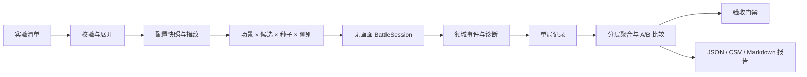

# 战斗模拟器设计

## 1. 文档定位

本文定义 Tiny Sea War 无图形战斗模拟器的目标、实验模型、执行流程、数据契约、统计口径、报告结构、确定性要求和实施顺序。

模拟器用于快速回答以下问题：

- 某个角色、武器、技能或公式调整是否造成明显强度漂移。
- 两支舰队在相同关卡、AI 和随机种子下，结果如何分布。
- 某个舰种、角色或编成是否在多数合理场景中成为唯一最优解。
- 战斗时长、首次接触、首次击沉、旗舰生存和超时率是否符合节奏目标。
- AI 是否会撞岸、空转主要武器、浪费技能、过量集火或长期无法接敌。
- 天气、时段、局部环境、设施、地形和出生位置是否带来预期影响。
- 一组候选参数相对当前基线改善了什么，又牺牲了什么。

本文不重新定义侦查、命中、伤害、移动、地形、设施、AI 或胜负规则。规则真源仍然是：

- 核心玩法：`docs/10_game_core_mechanics.md`
- 战斗公式：`docs/12_combat_formula_design.md`
- 平衡范围：`docs/13_balance_baseline.md`
- 角色草案：`docs/14_character_balance_design.md`
- 关卡与节奏：`docs/15_battle_level_design.md`
- AI 行为：`docs/16_enemy_ai_behavior_design.md`
- 趣味验收：`docs/17_play_design.md`
- 设施与环境：`docs/18_facility_weather_effect_design.md`
- 数据字段：`docs/20_data_schema_design.md`
- Domain 边界：`docs/32_domain_design_phase1.md`
- 场景战斗契约：`docs/35_scene_combat_domain_design.md`

模拟器是规则运行器、实验编排器和分析工具，不是另一套战斗系统。

---

## 2. 当前基线与缺口

项目已经具备模拟器的最小技术基础：

- `BattleSession` 不依赖战斗场景即可创建和推进战斗。
- `advance_tick()` 使用固定步长执行移动、侦查、AI、武器、伤害、地形、设施和胜负逻辑。
- `SeededRandomSource` 为单场战斗提供种子随机源。
- `BattleRecorder` 消费领域事件并输出基础统计。
- `scripts/tests/batch_simulation.gd` 能无画面运行五个现有关卡，每关固定执行 6 局。

该入口当前属于冒烟与回归测试，不是完整平衡模拟器。主要缺口包括：

- 关卡、舰队、AI、种子、Tick、重复次数和输出字段写死在脚本中。
- 不能安全地应用临时参数覆盖并比较基线与候选方案。
- 不能建立舰队交换、出生侧交换和配对种子实验。
- 统计粒度不足，无法解释角色、武器、技能、AI、环境和设施贡献。
- 没有置信区间、异常局检测、样本充分性提示和回归阈值。
- 没有实验清单、配置指纹、代码版本和结果文件之间的稳定追踪关系。
- 没有把模拟未结束、非法命令、规则断言、无接敌和数据缺失当成独立失败类别。
- 输出是一次性控制台 JSON，不适合作为持续调参、趋势比较和人工复核依据。

因此正式实现应复用现有基础，逐步替换硬编码批量脚本，而不是平行开发一个简化伤害计算器。

### 2.1 2026-06-29 首个可用版本

当前已实现阶段 A 主干和部分阶段 B 能力：

- `data/simulations/experiments/` 保存版本化实验清单。
- `SimulationExperimentLoader` 校验清单并展开显式或连续种子。
- `SimulationRunner` 直接驱动 `BattleSession`，区分正常结束、创建失败和 `GuardLimit`。
- `BaselineAutopilot` 通过普通命令为双方使用手动主要武器和技能，不绕过装填、射程、射角、侦查和目标规则。
- `SimulationAggregator` 输出完成率、胜率及 95% Wilson 区间、时长分布、接触/开火/击沉时间、双方射击/命中/伤害、分场景结果和单位平均有效伤害。
- `SimulationReportWriter` 输出 `runs.jsonl`、`aggregate.json`、`summary.csv` 和 `report.md`。
- `battle_simulator_test.gd` 独立验证清单、运行、确定性和报告落盘。
- 实验可用 `side_swap=true` 将原敌方阵容放到玩家出生点、原玩家阵容放到敌方出生点；同场景同种子按 `original` / `swapped` 生成配对结果。
- 单局逐舰伤害直接读取 `BattleSession.get_all_unit_damage_statistics()`，由 `damage_statistics.gd` 提供有效伤害、承伤、过量伤害、武器类别、武器明细和 Buff 贡献口径。
- `LatestRuntimeAI` 策略通过 `BattleSession.configure_full_ai_factions()` 让指定阵营使用当前完整量化 AI；双方都选择该策略时，共用目标评分、模式迟滞、Attack/Defend/Kite、预判主要武器、技能收益和即时规避逻辑，不调用 `BaselineAutopilot`。

尚未实现的主要能力是 Definition 参数覆盖、候选参数配对 A/B、并行恢复、完整 AI 动态指标和大规模编成抽样。因此当前状态是“模拟器首版可用”，不是本文全部阶段完成。

---

## 3. 设计原则

### 3.1 规则只有一个权威实现

正式模拟必须调用与可玩战斗相同的 `BattleSession`、Domain 服务、配置加载器和 AI 命令入口。

不得为了速度：

- 用 DPS 除以 HP 代替真实装填、射角、侦查和移动。
- 跳过投射物、地形、视线、环境或设施规则后仍把结果称为整局模拟。
- 为模拟器复制一套命中、装甲、伤害、技能或胜负公式。
- 让模拟 AI 直接扣血、传送、强制锁定或读取隐藏信息。

纯公式估算可以作为独立的静态分析工具，但输出必须标记为 `AnalyticalEstimate`，不能与 `FullBattleSimulation` 混合统计。

### 3.2 无图形不等于简化规则

无图形模式只移除：

- 场景节点实例化。
- 图片、动画、粒子、音效、镜头和 HUD。
- 表现层插值与视觉随机数。

它仍应执行：

- 固定 Tick、移动、碰撞和边界。
- 侦查、接触和阵营合法信息。
- AI 决策和普通命令校验。
- 自动武器、手动主要武器代理、技能和状态。
- 投射物、延迟攻击、命中与伤害。
- 地形、环境、设施、机场任务、水雷和胜负。

### 3.3 可复现优先于偶然快

每个结果必须能够由实验 ID、配置指纹、代码版本、关卡、双方策略、种子、固定步长和最大 Tick 重建。

相同输入在同一 Godot 与代码版本中应产生相同事件摘要和战斗结果。并行执行只能改变完成顺序，不能改变单局结果。

### 3.4 分布优先于单局结论

单局只能用于复盘，不能证明平衡。正式结论至少同时观察：

- 中位数和分位数。
- 均值与离散程度。
- 胜率及其区间。
- 超时、无接敌、断言失败等异常比例。
- 按角色、舰种、武器、地图、天气和阵营位置分层后的结果。

### 3.5 结果必须可解释

模拟报告不能只给出“胜率 62%”。至少需要说明优势来自：

- 更早建立接触。
- 更高有效射击时间。
- 更好的命中或对甲适配。
- 更高技能利用率。
- 更低主要武器空转率。
- 更强旗舰保护或更快斩首。
- 地形、设施或出生位置优势。
- AI 行为差异而非角色基础属性。

### 3.6 自动模拟不能代替玩家测试

模拟器擅长筛除明显失衡、验证规则回归和比较 AI 策略，但不能直接证明：

- 玩家操作是否顺手。
- 风险是否可读、反馈是否清楚。
- 主要武器是否有满足感。
- 失败是否让人理解并愿意再试。
- 战斗是否有张弛、戏剧性和角色记忆点。

数值候选通过模拟器后，仍需按 `docs/17_play_design.md` 做人工战斗与可读性验收。

---

## 4. 模拟器使用场景

### 4.1 规则回归

目标是确认代码或数据改动没有破坏既有确定性和不变量。

典型检查：

- 固定种子的胜负、结束原因和关键事件摘要不发生未解释变化。
- 未配置地形的开阔海域不受近岸代码影响。
- 表现、资产或 UI 改动不改变领域结果。
- 空间索引优化前后得到相同碰撞、视线和命中结果。

规则回归可以使用较小但稳定的种子集，并保存黄金摘要。黄金数据更新必须人工确认原因，不能在失败后自动覆盖。

### 4.2 角色与武器平衡

目标是比较角色、武器、弹药、技能或 Cost 的实际贡献。

推荐实验：

- 同 Cost 舰队替换一个角色，其余条件不变。
- 同一角色关闭技能、替换武器模式或改变单一参数。
- 同角色分别面对不同装甲厚度、舰种和规模。
- 以舰队贡献而非单舰裸伤害评估侦查、护航、防空和控制角色。

角色不要求对所有对手达到 50% 胜率。判断重点是其定位、代价、克制关系和可替代性是否合理。

### 4.3 编成与舰种生态

目标是发现唯一最优编成、无效舰种或 Cost 定价偏差。

模拟器应支持：

- 按单位数和 Cost 限制生成合法编成。
- 固定旗舰或遍历合法旗舰。
- 镜像、同 Cost、相邻 Cost 和极端职责编成。
- 统计角色选择率、胜率、边际贡献和常见搭档。

全排列增长过快时，使用分层抽样而不是盲目穷举。抽样必须覆盖舰种、Cost、旗舰和职责组合。

### 4.4 AI 行为与难度

目标是验证 AI 是否按设计做出合法、稳定且可理解的选择。

除胜率外，应优先检查 `docs/16_enemy_ai_behavior_design.md` 定义的行为指标，包括模式驻留、切换频率、鱼雷规避、路线失败、主要武器空转、技能浪费、过量伤害和设施响应。

难度档位只能调整决策间隔、可用评分项、记忆和协同程度，不得通过模拟器暗中修改 HP、命中、装填或伤害。

### 4.5 关卡、地图与环境

目标是比较地图尺度、出生距离、天气、时段、地形、设施和任务对战局的影响。

推荐实验：

- 同一舰队在 20 套时间天气组合下运行配对种子。
- 双方交换出生侧和阵营标签，识别地图侧偏。
- 开启与关闭某个设施、局部环境区或水雷布局。
- 比较开阔海域与近岸关卡中的舰种表现漂移。
- 检查首次接触、首次开火、战斗时长和超时率是否落在关卡目标区间。

### 4.6 参数 A/B 与灵敏度分析

目标是比较当前运行配置 `baseline` 与一个或多个候选覆盖 `candidate`。

候选实验应优先一次改变一个解释变量。需要同时改变多个字段时，应把它们定义为具名方案，并明确这是组合调整，不能把结果归因于单一字段。

对连续参数可运行小范围灵敏度扫描，例如：

```text
reload_time: -10%, -5%, baseline, +5%, +10%
armor:       -8, -4, baseline, +4, +8
cost:        -1, baseline, +1
```

扫描结果用于寻找拐点和副作用，不自动写回正式 `data/`。

---

## 5. 实验模型

### 5.1 SimulationExperiment

一次实验由一个不可变清单描述：

```text
experiment_id
description
simulation_kind
baseline_ref
candidate_overlays
scenario_refs
policy_refs
seed_plan
tick_seconds
maximum_ticks
replications
side_swap
output_profile
acceptance_profile_id
tags
```

字段含义：

- `experiment_id`：稳定实验 ID，不使用时间戳代替语义名称。
- `simulation_kind`：`FullBattleSimulation`、`RuleRegression`、`PolicyEvaluation` 或 `AnalyticalEstimate`。
- `baseline_ref`：当前正式配置快照。
- `candidate_overlays`：只用于本次实验的参数覆盖集合。
- `scenario_refs`：一个或多个场景定义。
- `policy_refs`：双方命令生产策略。
- `seed_plan`：固定列表、连续范围或显式生成规则。
- `tick_seconds`：固定模拟步长，正式比较默认与运行时一致。
- `maximum_ticks`：测试保护上限，不替代关卡 `time_limit`。
- `replications`：每个场景与候选的重复次数。
- `side_swap`：是否执行阵营和出生侧交换。
- `output_profile`：事件、单局、聚合和调试输出级别。
- `acceptance_profile_id`：可选的自动验收阈值。

### 5.2 SimulationScenario

场景描述一场战斗的完整初始条件：

```text
scenario_id
level_definition_id
player_fleet
enemy_fleet
player_flagship_id
enemy_flagship_id
player_policy_id
enemy_policy_id
map_overrides
environment_overrides
initial_state_overrides
```

第一阶段优先引用正式关卡 Definition。后续为了做角色对照，可允许在内存中建立经过同一校验器检查的临时舰队和关卡变体。

禁止通过 `initial_state_overrides` 建立正式规则无法产生的非法状态。该字段只服务于边界测试，例如指定 HP、冷却或位置，并必须标记实验为 `RuleRegression`。

### 5.3 SimulationPolicy

模拟器不假装成人类玩家。所有命令来源必须显式声明策略：

| 策略 | 用途 | 约束 |
| --- | --- | --- |
| `RuntimeAI` | 评估正式敌方 AI 或 AI 对战 | 只读阵营合法观察并提交普通命令 |
| `BaselineAutopilot` | 稳定的双边基线和角色数值筛查 | 行为固定、版本化，不随候选参数偷偷变化 |
| `ScriptedCommands` | 精确公式、技能、移动和回归测试 | 命令序列和触发条件完整记录 |
| `ReplayCommands` | 重放已记录命令流 | 必须匹配配置指纹和 Tick |
| `NoCommands` | 只测试自动武器或环境系统 | 明确表示没有外部战术操作 |

玩家主要武器在数值模拟中不能被忽略。`BaselineAutopilot` 或 `RuntimeAI` 必须通过普通 `FirePrimaryWeaponCommand` 使用它们；若策略不支持，应在报告中给出“主要武器未被利用”的显著警告，该结果不得用于角色最终强度结论。

### 5.4 参数覆盖

候选参数使用内存覆盖层：

```text
overlay_id
target_definition_type
target_definition_id
field_path
operation
value
```

`operation` 第一阶段只允许：

- `Set`
- `Add`
- `Multiply`

覆盖应用顺序固定为 `baseline -> experiment overlay -> scenario overlay`。每次应用后必须重新执行配置引用和数值校验。模拟器不得直接修改正式 JSON，也不得把覆盖后的 Definition 缓存回全局注册表。

---

## 6. 执行流程



### 6.1 校验与展开

运行前必须：

1. 加载正式 Definition。
2. 应用候选覆盖并重新校验。
3. 校验双方舰队、旗舰、Cost、角色重复和关卡引用。
4. 展开场景、候选、种子和侧别的笛卡尔积。
5. 为每一局生成稳定 `run_id`。
6. 在执行前写出解析后的实验清单，避免运行中断后失去上下文。

### 6.2 单局推进

单局流程：

```text
validated definitions
+ scenario
+ policies
+ battle seed
-> create BattleSession
-> while Running and tick < maximum_ticks
   -> policy observes legal snapshot
   -> policy queues commands
   -> advance_tick(fixed_delta)
   -> recorder consumes events
   -> diagnostics checks invariants
-> Finished / GuardLimit / RuntimeError
-> finalize run record
```

`maximum_ticks` 是防止程序缺陷无限运行的保护门。达到保护门时结果必须记为 `GuardLimit`，不能按超时规则偷偷决定胜负。

### 6.3 加速方式

无图形模拟不等待真实时间，每个 Tick 连续执行。允许的加速方式：

- 不创建 Presentation。
- 不生成完整视觉快照。
- 按输出级别关闭非必要调试事件落盘。
- 多进程或多工作单元并行运行互相独立的战斗。
- 将聚合统计流式写入，避免所有事件长期留在内存。

不允许通过增大正式固定步长来获得 A/B 加速。不同 Tick 只能作为专门的数值稳定性实验，不能与标准结果混合。

### 6.4 并行与恢复

实验矩阵按独立 `run_id` 分片。每个工作单元拥有独立：

- `BattleSession`
- Definition 快照或只读副本
- 随机源
- 记录器
- 输出临时文件

单局完成后以原子方式发布结果。重新运行时可以跳过配置指纹一致且已完整结束的 `run_id`。最终聚合按 `scenario_id`、候选、种子和侧别排序，不依赖工作完成顺序。

---

## 7. 随机种子与公平比较

### 7.1 种子计划

支持三种方式：

- `ExplicitList`：用于回归的人工固定种子。
- `SequentialRange`：用于常规批量实验。
- `Derived`：由实验 ID、场景 ID 和重复索引稳定派生。

报告必须保存实际种子列表，不能只保存“随机 100 局”。

### 7.2 配对种子

A/B 比较使用共同随机数：基线和候选在相同场景使用相同种子。这样可以减少随机命中与散布带来的比较噪声。

配对不代表两局会消耗完全相同的随机序列。候选参数可能改变开火次数和事件路径，因此报告仍应以最终配对差值分布为准，不能假设逐 Tick 对齐。

### 7.3 侧别交换

非对称地图、出生点、设施或 AI 标签可能产生侧偏。平衡实验默认执行：

1. A 舰队为 `player`、B 舰队为 `enemy`。
2. B 舰队为 `player`、A 舰队为 `enemy`。

若关卡语义不允许交换，实验必须标记 `side_swap=false` 并单独报告侧别限制。镜像对局也要交换出生侧，不能用单侧镜像胜率证明公平。

### 7.4 随机源隔离

战斗规则、策略探索和报告抽样使用不同随机源：

- `battle_random`：命中、散布和正式规则随机。
- `policy_random`：仅在策略明确允许随机探索时使用。
- `analysis_random`：bootstrap 或报告抽样。

新增调试日志、统计字段或报告格式不得消耗 `battle_random`。

---

## 8. 记录模型

### 8.1 实验元数据

每次实验至少记录：

```text
schema_version
experiment_id
created_at
code_revision
working_tree_state
godot_version
platform
manifest_hash
definition_hashes
policy_versions
tick_seconds
actual_run_count
```

工作区存在未提交改动时允许运行，但必须记录 `working_tree_state=dirty` 和相关配置/代码指纹。报告不能伪装成可由仓库提交直接重建的干净基线。

### 8.2 单局结果

每局至少记录：

- `run_id`、场景、候选、种子、侧别和策略版本。
- 创建是否成功及配置错误。
- 结束状态：`Finished`、`GuardLimit`、`InvariantFailure` 或 `RuntimeError`。
- 胜方、结束原因、持续时间和 Tick 数。
- 双方初始/剩余 HP、存活数、旗舰状态和 Cost。
- 首次发现、首次开火、首次命中、首次击沉和旗舰击沉时间。
- 命令接受/拒绝数量及原因。
- 异常、断言、无路可达和停滞诊断。

### 8.3 单位指标

每个单位至少记录：

- 定义 ID、舰种、Cost、阵营、旗舰身份。
- 伤害、承伤、治疗、补给和有效生存时间。
- `damage_by_category` 保存互斥的主炮、副炮、鱼雷、航空、防空、反潜、技能等有效伤害；`damage_by_weapon` 保存武器级明细，类别和必须能与 `damage_dealt` 对账。
- `contribution_damage_by_category` 单独保存 Buff 等间接贡献，不重复计入直接伤害；当前 Buff 贡献按正向状态修正值权重归入状态来源舰船。
- 发射、命中、0 伤害、有效伤害和击沉数。
- 首次发现时间、被发现累计时间和开火暴露累计时间。
- 移动距离、平均速度、静止时间、岸线碰撞和边界钳制。
- 主要武器可用时间、待发时间、空转率和非法发射原因。
- 技能可用、释放、命中/覆盖、贡献和浪费次数。
- 对旗舰、各舰种和各装甲厚度的伤害分布。

### 8.4 武器与技能指标

武器按 `weapon_definition_id` 和 `weapon_group_id` 聚合：

- 装填循环数、发射轮数和理论可发射轮数。
- 每轮发数、命中率、0 伤害率和每发/每轮伤害。
- 因射程、射角、视线、地形、目标类型和装填被拒绝的次数。
- 火炮落区有效率、鱼雷命中/撞岸/耗尽航程比例。
- HE/AP 使用比例和对不同装甲的收益。
- 航空单位损失、有效伤害折损和防空拦截贡献。

技能至少记录释放时机、目标数量、状态覆盖时间、直接伤害、间接增益和保留原因。间接贡献无法可靠归因时应输出事实指标，不伪造精确伤害归因。

### 8.5 AI 与空间指标

AI 指标遵循 `docs/16_enemy_ai_behavior_design.md`：

- 模式/战术驻留与每分钟切换次数。
- 发现至响应延迟。
- 危险鱼雷规避率和安全鱼雷误规避率。
- 目标切换、过量伤害、技能保留与协同跟进。
- 路线失败、卡住恢复、岸线风险和边界强制处理。
- 占领、防守、补给、维修和机场任务的成功/中断原因。

地图与环境指标至少包括：

- 各 TerrainContext 中的累计时间。
- 各设施控制、压制、恢复和摧毁时间。
- 设施来源伤害、侦查、补给、维修和任务贡献。
- 出生侧、天气、时段和局部环境下的结果分层。

---

## 9. 聚合与统计口径

### 9.1 基础聚合

连续指标默认输出：

- 样本数 `n`
- 均值
- 中位数
- 标准差
- P10 / P25 / P75 / P90
- 最小值 / 最大值

比例指标输出：

- 事件数与分母
- 比例
- 95% 区间

胜率不能省略平局、超时、GuardLimit 和失败样本。不同结束类别必须先分开，再按明确口径计算有效对局胜率。

### 9.2 A/B 差值

候选相对基线至少输出：

- 胜率百分点变化。
- 配对战斗时长差。
- 配对剩余 HP 差。
- 角色/武器/技能贡献差。
- 异常率、超时率和无接敌率变化。
- 各地图、天气、对手和侧别分层差异。

报告同时显示绝对值和相对变化，避免低基数百分比夸大。

### 9.3 样本量

推荐最小值：

| 用途 | 每代表场景种子数 | 说明 |
| --- | ---: | --- |
| 单局冒烟 | 1 | 先检查能启动、能结束且关键战斗事件完整 |
| 小样本门禁 | 3 | 单局通过后检查不同种子均能正常结算与产出指标 |
| AI 动态验收 | 20 | 三局通过后再运行正式样本；与 `docs/16_enemy_ai_behavior_design.md` 一致 |
| 固定回归 | 10-20 | 使用稳定种子，关注未解释漂移 |
| 初步平衡筛查 | 50-100 | 用于发现大幅差异，不定最终结论 |
| 关键 A/B 决策 | 200 以上 | 结合区间和分层结果判断 |

默认执行顺序必须是 `1 -> 3 -> 20`，任一阶段失败时先停止、定位和修复，不继续扩大样本。表中是起点，不是充分性的保证；结果接近门槛、方差过高或稀有事件重要时，可在 20 局正式样本之后另行增加专项样本。

### 9.4 多重比较

大规模角色、编成和参数扫描会自然出现偶然极值。模拟器应：

- 区分预先声明的主要指标和探索性指标。
- 对极端结果用新种子复验。
- 不因一次大矩阵中的单个异常胜率立即修改正式数据。
- 优先寻找跨地图、跨对手、跨种子稳定存在的模式。

### 9.5 平衡判断

模拟器不提供一个把所有维度压成单分的“角色强度真值”。平衡判断至少同时看：

- Cost 效率。
- 舰队边际贡献。
- 对局与地图覆盖面。
- 明确优势和可利用弱点。
- 角色职责是否改变行为。
- 是否挤压同职责角色选择。
- 是否依赖 AI 缺陷或单一关卡结构。

---

## 10. 报告与产物

推荐输出目录：

```text
artifacts/simulations/{experiment_id}/
  resolved_manifest.json
  metadata.json
  runs.jsonl
  aggregate.json
  comparison.csv
  report.md
  failures/
    {run_id}.json
```

`artifacts/simulations/` 默认是生成物目录，不作为运行时数据源。是否纳入 Git 由后续实现时统一决定；固定回归黄金摘要可另放到版本控制的测试夹具目录。

### 10.1 JSON

JSON 是机器可读真源，保存完整元数据、单局结果、聚合值和验收结果。字段必须带 `schema_version`。

### 10.2 CSV

CSV 面向表格分析，至少提供：

- 一行一局。
- 一行一单位一局。
- 一行一武器一局。
- 一行一候选聚合比较。

### 10.3 Markdown

Markdown 报告面向设计复核，顺序建议为：

1. 结论摘要。
2. 实验问题与候选参数。
3. 样本、场景和策略。
4. 主要指标与区间。
5. 分层结果。
6. 异常局与代表种子。
7. 风险、不能下的结论和下一步建议。

报告应列出最值得人工复盘的种子，例如最快斩首、最长无接敌、最大逆转、异常高伤害和路线失败局。

---

## 11. 验收门禁

自动门禁分为四类，不能只设胜率门槛。

### 11.1 完整性门禁

- 所有计划运行都有结果。
- 创建失败、RuntimeError、InvariantFailure 和 GuardLimit 均为 0，除非实验明确测试非法输入。
- 输出清单、配置指纹和实际运行数一致。
- 单局与聚合计数能够对账。

### 11.2 规则门禁

- 相同输入可复现。
- 侧别交换、开关 Presentation 和优化路径不改变不应改变的规则结果。
- 非法命令只产生稳定拒绝，不造成部分状态修改。
- AI 和策略不读取隐藏信息或绕过 Domain。

### 11.3 节奏门禁

对照现有目标：

- 小船被集火约 5-12 秒沉没。
- 大船被持续磨血约 60-120 秒沉没。
- 3v3、5v5、11v11 目标完成时间分别约 4-7、6-9、8-12 分钟。
- 不得频繁达到 20 分钟硬时限。
- 不得长期无目标追逐、无法接敌或主要武器持续空转。

这些区间用于发现偏离，不要求每个极端编成都落在区间内。

### 11.4 行为与平衡门禁

- AI 行为指标先通过，再解释胜率。
- 强势方案不能只在单一侧别、地图或种子组成立。
- 候选不得以明显增加撞岸、技能浪费、非法命令或超时换取胜率。
- 单角色增强不能使多数合法编成中出现无替代的唯一最优解。
- 角色、武器或技能贡献异常时能追溯到具体事件和规则路径。

验收 Profile 可以自动给出 `pass`、`warn`、`fail`，但正式数值写回仍由设计者决定。

---

## 12. 程序分层与建议落点

模拟器遵守现有分层：

```text
scripts/
  application/
    simulation/
      simulation_runner.gd
      experiment_expander.gd
      policy_controller.gd
  infrastructure/
    simulation/
      experiment_loader.gd
      definition_overlay.gd
      simulation_writer.gd
      simulation_aggregator.gd
      simulation_comparator.gd
    analytics/
      battle_recorder.gd
      simulation_recorder.gd
  tests/
    batch_simulation.gd
    simulation_regression_test.gd

data/
  simulations/
    experiments/
    scenarios/
    policies/
    acceptance_profiles/

tools/
  simulation/
    run_experiment.gd
```

职责：

- `BattleSession`：唯一整局规则协调入口，不认识实验矩阵或 CSV。
- `SimulationRunner`：创建会话、驱动策略、推进 Tick、分类结束状态。
- `ExperimentExpander`：展开候选、场景、种子和侧别。
- `PolicyController`：只生成命令，不直接改状态。
- `DefinitionOverlay`：创建隔离的候选 Definition 注册表并重新校验。
- `SimulationRecorder`：在 `BattleRecorder` 基础上记录平衡、AI、地形和异常指标。
- `SimulationAggregator`：聚合单局数据，不反向影响战斗。
- `SimulationComparator`：生成配对 A/B 差值和门禁结果。
- `SimulationWriter`：负责 JSONL、JSON、CSV 和 Markdown。

现有 `scripts/tests/batch_simulation.gd` 在迁移期保留为快速冒烟入口，最终应改为调用 `SimulationRunner` 的一个小型内置实验，而不是继续维护独立循环和统计逻辑。

模拟配置正式落地前，必须在 `docs/20_data_schema_design.md` 补充字段，并在 `docs/34_implementation_map.md` 更新入口。本文只定义目标契约，不表示这些目录和字段当前已经实现。

---

## 13. 性能目标

第一阶段性能目标以开发机无图形运行作为口径：

- 1v1、3v3 和 5v5 应明显快于实时速度。
- 11v11 与港湾关卡允许较慢，但正式 20 局样本不应依赖场景渲染；性能专项独立于功能正确性门禁。
- 默认聚合模式不保存每 Tick 全量快照。
- 事件记录量应能按 `summary`、`diagnostic`、`trace` 三档切换。
- `trace` 只用于少量异常种子，不用于数百局常规矩阵。

不得在没有性能测量前承诺固定倍速。模拟器报告应记录总墙钟时间、每模拟秒耗时、每局 Tick 数和失败重试数，后续再建立硬预算。

性能优化优先顺序：

1. 移除表现与无用快照。
2. 减少统计对象复制和字符串化。
3. 利用地形空间索引与既有低频决策。
4. 并行独立战斗。
5. 在证明结果一致后优化热点算法。

---

## 14. 测试矩阵

### 14.1 模拟器自身

- 同一实验展开得到稳定且不重复的 `run_id`。
- 覆盖层不修改基础注册表。
- 非法字段、引用、舰队和旗舰在执行前被拒绝。
- 中断后只恢复完整且指纹匹配的单局。
- 并行与串行运行的排序后结果一致。
- JSONL、聚合 JSON 和 CSV 计数一致。

### 14.2 确定性

- 相同关卡、策略、种子、Tick 和配置得到相同事件摘要。
- 新增统计字段不改变战斗结果。
- `summary` 与 `trace` 输出级别不改变战斗结果。
- 基线与无操作覆盖候选得到相同结果。
- 侧别交换执行两局且种子配对正确。

### 14.3 统计正确性

- 人工构造结果的均值、中位数、分位数和比例区间正确。
- GuardLimit、错误局和平局不会被静默计入某方失败。
- 配对 A/B 只比较共享场景、种子和侧别的完整对局。
- 单位、武器、技能和舰队指标能够与事件记录对账。

### 14.4 规则覆盖

至少建立以下代表场景：

- 开阔海域 1v1：公式、对甲、命中和斩首。
- 开阔海域 3v3：侦查、集火、技能和职责协同。
- 5v5：中规模舰种生态和 AI 协同。
- 11v11：性能、目标预留和战斗收束。
- 港湾 3v3：地形、航道、环境、设施、机场和水雷。
- 天气配对：晴朗、降雨、雷暴及昼夜代表组合。
- 潜艇/航空专项：发现、反潜、防空和近身威胁。

### 14.5 故障注入

- 不存在的关卡、角色、武器和技能引用。
- 无旗舰、双旗舰、重复角色和 Cost 超限。
- 策略持续提交非法命令。
- 双方无法接敌或永不造成伤害。
- 最大 Tick 触发。
- 输出目录不可写和单个工作单元异常退出。

故障注入用于验证错误报告，不应污染正式平衡聚合。

---

## 15. 实施顺序

### 阶段 A：正式批量运行骨架

1. 把现有硬编码批量循环抽成 `SimulationRunner`。
2. 支持实验清单、显式种子、固定 Tick、最大 Tick 和结构化输出。
3. 修正并统一完成局、异常局和 GuardLimit 的统计口径。
4. 保存配置指纹、代码版本和可复现命令。
5. 用现有五个关卡建立冒烟实验。

完成标志：可以通过一个实验清单运行五个关卡，并输出可追踪的单局与聚合 JSON。

### 阶段 B：统计与报告

1. 扩展记录器的单位、武器、技能、命令和异常指标。
2. 增加 JSONL、CSV 和 Markdown 报告。
3. 增加分位数、比例区间、分层聚合和代表种子列表。
4. 接入 AI 动态指标和港湾空间/设施指标。

完成标志：报告能够解释胜率、时长和异常的主要来源，而不是只输出平均伤害。

### 阶段 C：A/B 与参数覆盖

1. 实现隔离 Definition 覆盖和重新校验。
2. 实现基线/候选、配对种子和侧别交换。
3. 实现单参数扫描和具名组合候选。
4. 增加验收 Profile 与回归阈值。

完成标志：候选参数无需修改正式 JSON 即可和基线公平比较，报告能输出配对差值与风险。

### 阶段 D：编成与持续平衡

1. 支持合法编成生成和分层抽样。
2. 建立角色、舰种、Cost、地图、天气和 AI 版本的趋势数据。
3. 为关键规则建立小型黄金摘要回归集。
4. 将重要冒烟与回归实验接入日常自动测试。

完成标志：模拟器可以稳定支持角色调整、AI 调权、关卡验收和舰种生态分析，并能指出需要人工实机复核的代表对局。

---

## 16. 首轮标准实验集

正式实现后，建议先建立以下具名实验：

| 实验 ID | 场景 | 种子 | 目的 |
| --- | --- | ---: | --- |
| `sim.smoke.current_levels` | 当前五个可玩关卡 | 每关 6 | 替代现有硬编码冒烟，检查正常结束 |
| `sim.regression.open_sea` | 1v1 / 3v3 / 5v5 / 11v11 | 每关 10 | 开阔海域规则与确定性回归 |
| `sim.regression.harbor` | 港湾 3v3 | 10 | 地形、设施、环境和水雷回归 |
| `sim.ai.dynamic_representative` | 五个当前关卡 | 每关按 1、3、20 阶梯执行 | AI 行为动态验收 |
| `sim.balance.phase1_roles` | 第一期角色代表编成 | 每组 50 | 舰种职责和 Cost 初筛 |
| `sim.environment.palette_pairs` | 代表舰队 × 20 palette | 每组 30 | 时间天气影响与极端组合检查 |

首轮不立即穷举 48 名角色的所有组合。第二期角色尚未完整进入关卡与动态平衡验收，应先建立合法测试舰队、策略覆盖和专项场景，再扩大矩阵。

---

## 17. 完成标准

战斗模拟器达到首个可用版本，需要同时满足：

- 无场景树和图形渲染即可运行与可玩战斗相同的完整规则。
- 实验可配置关卡、舰队、策略、候选参数、种子、重复数、侧别和输出级别。
- 每局结果包含足够的元数据和配置指纹，可稳定重现异常。
- 基线与候选使用配对种子，并能交换阵营与出生侧。
- 完整局、超时局、GuardLimit、断言失败和运行错误分别统计。
- 单位、武器、技能、AI、环境和设施指标能由领域事件追溯。
- 报告包含分布、区间、分层结果、A/B 差值和代表种子。
- 批量模拟不直接修改正式配置，不建立第二套公式或 AI 特权。
- 现有五个关卡有冒烟实验，代表关卡有固定回归种子集。
- 模拟器结论明确区分“规则正确”“自动策略下数值合理”和“人工实机体验通过”。

模拟器的价值不在于替设计者宣布一个角色“平衡”，而在于把调参从零散观感变成可复现、可解释、能快速排除错误方向的实验过程。
