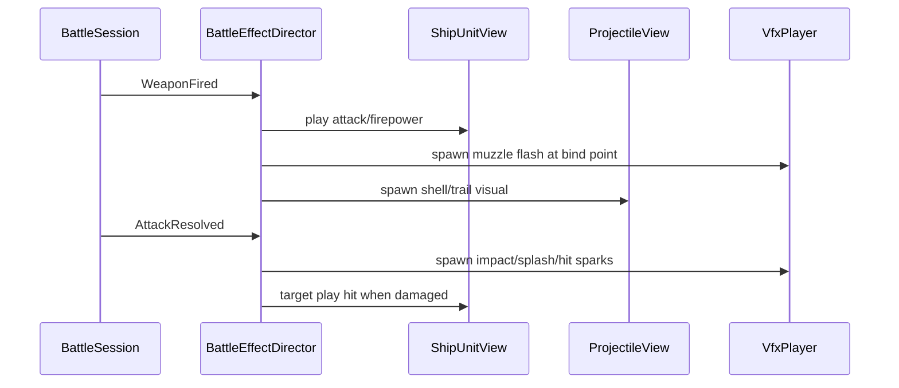

# 第二阶段 Domain 与表现设计

## 1. 文档目的

本文档定义第二阶段的程序设计方向：在第一阶段战斗规则、操作闭环和 HUD 基础上，接入角色动画、VFX 绑定、火炮、鱼雷和舰载机表现，使战斗画面从“可读的逻辑原型”推进到“有战斗反馈的可玩原型”。

第二阶段的核心原则：

- 战斗规则仍由 Domain / Application 决定。
- 动画、VFX、弹体贴图、镜头和 UI 只消费快照与事件，不反向决定命中、伤害或胜负。
- 表现系统可以丢帧、降级或关闭，但不能改变战斗结果。
- 现有角色动画、VFX、绑定点和 UI 资产优先接入；QA 资产不进入运行画面。
- 暂不设计展示页、图鉴页或独立演示器。

相关文档：

- `docs/32_domain_design_phase1.md`
- `docs/42_combat_art_design.md`
- `docs/44_ui_art_design.md`
- `docs/45_art_asset_interface_design.md`
- `docs/94_art_asset_usage_audit.md`
- `docs/95_art_asset_next_stage_assessment.md`

---

## 2. 阶段目标

### 2.1 必须完成

- 角色动画状态机接入 `idle / move / attack / hit / firepower`。
- 战斗单位从静态双图层升级为可播放动画、可挂接 VFX 的视图对象。
- 角色绑定点可用于炮口、鱼雷口、航迹、扫描和舰载机起飞点。
- 火炮发射有炮口火光、弹道/拖尾、落水或命中反馈。
- 鱼雷发射有实体、航迹、预警线或扇面、命中反馈。
- HUD 继续使用当前 UI 美术语言，并逐步接入更多 UI 资产。
- 表现层通过领域事件驱动，不在 `_draw` 中猜测所有一次性表现。

### 2.2 建议完成

- 新增通用表现配置：`data/visuals/`。
- `AssetCatalog` 增量扩展动画、VFX、绑定点、通用 projectile visual 和 weapon visual 查询。
- 事件到表现的映射可配置，避免按角色名硬编码。
- 战斗表现具备对象池或轻量回收策略，避免 11v11 时频繁创建节点。

### 2.3 暂不作为本阶段完成条件

- 完整舰载机战斗规则。
- 全角色专属技能演出。
- 高级沉没动画。
- 复杂多帧爆炸序列。
- 战斗外展示页。
- QA 资产进入运行画面。

---

## 3. 分层边界

### 3.1 Domain 不新增视觉职责

Domain 仍只负责：

- 单位状态。
- 武器冷却。
- 投射物逻辑。
- 命中、伤害和沉没。
- 胜负和统计事实。

Domain 不负责：

- 播放哪张贴图。
- VFX 持续多久。
- 炮口火光大小。
- 鱼雷尾迹颜色。
- 舰载机编队插值曲线。
- HUD 动画和镜头震动。

### 3.2 Application 输出表现所需事实

`BattleSession` 继续作为战斗用例入口。第二阶段需要保证事件足够支持表现层，不要求 Domain 知道表现资源。

建议事件包含：

| 事件 | 用途 | 必需字段 |
| --- | --- | --- |
| `UnitSpawned` | 创建单位视图 | `unit_id`、`definition_id`、`faction_id`、`position` |
| `UnitMoved` 可选 | 高级移动表现 | `unit_id`、`from`、`to`、`speed` |
| `WeaponFired` | 炮口、鱼雷、开火动画 | `source_unit_id`、`weapon_id`、`projectile_id`、`origin`、`target_position`、`heading`、`salvo_index`、炮击逐发 `impact_positions` |
| `ProjectileSpawned` | 创建弹体视图 | `projectile_id`、`source_unit_id`、`weapon_id`、`position`、`heading`、`speed` |
| `ProjectileExpired` | 弹体淡出 | `projectile_id`、`position`、`reason_code` |
| `AttackResolved` | 命中、水花、受击动画 | `damage_result`、`impact_position`、`weapon_id`、`projectile_id` |
| `AreaAttackResolved` 可选 | 区域落点多反馈 | `attack_id`、`impact_position`、`affected_unit_ids` |
| `SkillCast` | 技能 VFX 与 cut-in | `unit_id`、`skill_id`、`target_ref` |
| `UnitSunk` | 沉没反馈 | `unit_id`、`source_unit_id` |
| `BattleFinished` | 结算画面 | `result` |

已有事件不足时，优先扩展事件 payload，而不是让 Presentation 读取领域内部临时字段。

### 3.3 Presentation 拆分建议

当前 `prototype_battle.gd` 已承担过多职责。第二阶段建议逐步拆分：

```text
scripts/presentation/battle/
  prototype_battle.gd              # 场景编排、输入、session 推进
  battle_hud.gd                    # HUD 与结算
  ocean_surface.gd                 # 海面
  ship_unit_view.gd                # 单位图层、动画、绑定点
  animation_state_machine.gd       # 角色动画状态机
  vfx_player.gd                    # 一次性 VFX 播放
  projectile_view.gd               # 弹体/鱼雷实体视图
  aircraft_view.gd                 # 舰载机表现视图
  battle_effect_director.gd        # 消费事件并派发表现
```

拆分可以渐进进行；第一版可以先在现有 `prototype_battle.gd` 中接最小系统，再抽文件。

---

## 4. 资产接口设计

### 4.1 延续现有 AssetCatalog

继续使用：

- `DataRegistry.assets.animation_state(character_id, state_name)`
- `DataRegistry.assets.vfx_role(character_id, role_name)`
- `DataRegistry.assets.bind_points(character_id, asset_name)`
- `DataRegistry.assets.battle_asset_path(character_id, semantic_name)`
- `DataRegistry.assets.ui_asset_path(asset_key, scale)`

第二阶段建议补充：

```gdscript
DataRegistry.assets.animation_states(character_id)
DataRegistry.assets.vfx_roles(character_id)
DataRegistry.assets.battle_asset_paths(character_id)
DataRegistry.assets.bind_point(character_id, asset_name, point_name)
DataRegistry.assets.projectile_visual(projectile_key)
DataRegistry.assets.weapon_visual(character_id, weapon_id)
DataRegistry.assets.vfx_playback_profile(profile_key)
```

### 4.2 新增表现配置

建议新增：

```text
data/visuals/projectile_visuals.json
data/visuals/weapon_visuals.json
data/visuals/vfx_playback_profiles.json
```

`projectile_visuals.json` 示例：

```json
{
  "definitions": [
    {
      "id": "visual.shell.large",
      "projectile_type": "Shell",
      "sprite": "res://assets/vfx/combat/projectiles/shells/projectile_shell_large.png",
      "trail_profile_id": "vfx.trail.shell.long",
      "impact_profile_id": "vfx.impact.water.large",
      "miss_profile_id": "vfx.impact.water.medium",
      "scale": 1.0,
      "rotation_mode": "Velocity"
    }
  ]
}
```

`weapon_visuals.json` 示例：

```json
{
  "definitions": [
    {
      "id": "weapon_visual.warspite_main",
      "character_id": "warspite",
      "weapon_group_id": "warspite_main",
      "projectile_visual_id": "visual.shell.large",
      "muzzle_vfx_role": "heavy_muzzle",
      "trail_vfx_role": "shell_trails",
      "impact_vfx_role": "splash",
      "fire_animation_state": "firepower",
      "launch_point_role": "muzzle_group"
    }
  ]
}
```

`vfx_playback_profiles.json` 示例：

```json
{
  "definitions": [
    {
      "id": "vfx.muzzle.large",
      "duration": 0.22,
      "loop": false,
      "anchor": "muzzle",
      "z_layer": "EffectAboveUnit",
      "rotation_mode": "OwnerHeading",
      "scale": 1.0,
      "follow_owner": false,
      "blend_mode": "Add"
    }
  ]
}
```

### 4.3 绑定点归一

程序侧需要兼容旧命名，但新配置优先使用以下语义：

| 语义 | 标准名 | 兼容名 |
| --- | --- | --- |
| 炮口 | `muzzle_01`、`muzzle_02`、`muzzle_group` | `muzzle` |
| 鱼雷口 | `torpedo_port_01`、`torpedo_port_02` | `torpedo_port`、`torpedo_mount` |
| 航迹 | `wake_origin` | `origin` |
| 舰载机起飞 | `aircraft_launch_01`、`aircraft_launch_02` | `launch_marker` |
| 舰载机回收 | `aircraft_recovery` | 无 |
| 技能/扫描 | `scan_origin`、`skill_origin` | `command_origin`、`aura_origin` |
| 舰装挂点 | `rig_mount` | 无 |

绑定点坐标以资源本地坐标为准。`ShipUnitView` 负责把本地绑定点转换到世界坐标。

---

## 5. 角色动画状态机

### 5.1 状态

第一版只接入已有状态：

| 状态 | 触发 | 是否循环 |
| --- | --- | --- |
| `idle` | 默认、静止、非一次性动作结束 | 是 |
| `move` | 单位速度高于阈值 | 是 |
| `attack` | 普通开火事件 | 否 |
| `firepower` | 主炮、技能炮击或强火力事件 | 否 |
| `hit` | 受击或造成明显伤害 | 否 |

状态优先级：

```text
hit > firepower > attack > move > idle
```

非循环状态播放结束后，按当前速度回到 `move` 或 `idle`。

### 5.2 触发来源

- `WeaponFired`：触发 `attack` 或 `firepower`。
- `AttackResolved` 且目标为本单位并 `final_damage > 0`：触发 `hit`。
- 快照中位置变化或 `current_speed > 0`：触发 `move`。
- 其他情况：`idle`。

### 5.3 不变量

- 动画状态不能修改单位生命、位置、冷却或命中结果。
- 播放失败时回退到当前静态 `body_r + rig_base`。
- 动画帧切换不影响碰撞半径和选择判定。

---

## 6. 战斗单位视图

### 6.1 ShipUnitView 职责

`ShipUnitView` 负责一个单位的所有可见图层：

- 战斗主体图层。
- 舰装图层。
- 炮塔/鱼雷管/扫描节点等附属部件。
- 当前动画帧。
- 血条、选中、目标、旗舰等贴近单位的战场标记。
- 本单位持续 VFX，例如航迹、潜艇阴影、技能光环。

### 6.2 图层建议

```text
z -30  wake / underwater shadow
z -10  rig base
z   0  body
z  10  turret / torpedo tube / nodes
z  20  muzzle flash / short VFX
z  30  unit markers
```

HUD 仍由 `CanvasLayer` 绘制，不进入单位视图。

### 6.3 部件旋转

第二阶段只要求最小可读：

- 主炮塔可朝目标方向或单位航向旋转。
- 鱼雷管可朝发射方向旋转。
- 无绑定点或无节点图时回退到单位航向。

炮塔旋转属于表现，不影响 `fire_arc` 校验；`fire_arc` 仍由 Domain 决定。

---

## 7. VFX 播放系统

### 7.1 VFX 类型

| 类型 | 生命周期 | 示例 |
| --- | --- | --- |
| OneShot | 播放一次后销毁 | 炮口火光、命中火花、水花 |
| LoopAttached | 挂在单位上循环 | 航迹、光环、潜艇阴影 |
| AreaPersistent | 持续一段时间 | 技能范围、烟幕、危险区 |
| Trail | 跟随弹体或路径 | 炮弹拖尾、鱼雷尾迹 |

### 7.2 播放输入

VFX 播放只需要表现参数：

```text
asset_path
position
rotation
scale
duration
loop
z_layer
follow_owner
modulate
```

`BattleEffectDirector` 从事件、快照和 `weapon_visual` / `projectile_visual` 组合出这些参数。

### 7.3 降级规则

当同屏效果过多：

1. 保留鱼雷、主炮落点、命中、旗舰危险。
2. 降低副炮烟尘、远处小火花、持续航迹透明度。
3. 合并同一位置短时间内的多次水花。
4. 禁止因为 VFX 降级跳过 `AttackResolved` 或 `UnitSunk` 的 UI 反馈。

---

## 8. 火炮表现设计

### 8.1 事件流



### 8.2 火炮弹体

火炮分为：

- `visual.shell.small`
- `visual.shell.medium`
- `visual.shell.large`

第一版可以使用短线/贴图沿直线或简化抛物线移动。
Area 型主炮的真实伤害在延迟落点结算时发生；表现上允许提前显示飞行轨迹，但命中反馈必须等待 `AttackResolved`。

### 8.3 命中反馈

- 命中舰体：装甲火花、爆烟、目标 `hit` 动画。
- 未命中但落水：水柱、涟漪。
- 区域攻击无目标：只播放落水或爆炸。
- AP 与 HE 可以先共用资源，通过颜色或冲击大小轻微区分。

---

## 9. 鱼雷表现设计

### 9.1 事件流

鱼雷是可持续威胁，必须有实体视图：

```text
WeaponFired -> torpedo launch VFX -> ProjectileSpawned -> ProjectileView 持续移动
ProjectileExpired / AttackResolved -> 命中或消失 VFX -> 移除 ProjectileView
```

### 9.2 鱼雷类型

- `visual.torpedo.surface`
- `visual.torpedo.submarine`

水面鱼雷：

- 可见实体与水面尾迹。
- 发射时使用鱼雷口绑定点。
- 预警线或扇面使用 UI 危险色和不同线型。

潜射鱼雷：

- 初段使用气泡和低亮尾迹。
- 从 `torpedo_port_*` 或 `origin` 发出。
- 侦测规则仍由 Domain 决定；表现不得泄露未发现潜艇位置。

### 9.3 命中反馈

- 命中：水下冲击、水柱、目标 `hit`。
- 寿命结束：小涟漪、淡出。
- 多枚鱼雷同屏时允许共用尾迹材质，避免大量 Sprite。

---

## 10. 舰载机表现设计

第二阶段可以先设计接口与表现原型，不要求完整航空规则落地。

### 10.1 所需新增领域/应用概念

若要完整接入舰载机，需要新增或扩展：

- `Aviation` 武器定义。
- `projectile.aircraft_*` 或 `aircraft_actor` 运行时实体。
- 飞机生命、编队数量、出击批次。
- 防空拦截与飞机损耗。
- 航空攻击到达后投弹/投雷的二段结算。

### 10.2 表现原型

第一版表现可按 `SkillCast` 或 `WeaponFired` 触发：

- 从 `aircraft_launch_*` 生成飞机小图。
- 飞机按路径飞向目标区。
- 到达后播放 `airstrike_area` 或投弹/投雷 VFX。
- 返航或淡出。

此原型不应改变当前非航空战斗规则。若无航空 weapon，不能伪造实际伤害。

### 10.3 舰载机资产需求

需要：

- 战斗机、轰炸机、鱼雷机基础小图和阴影。
- 编队路径/方向提示。
- 投弹、投雷、被击落、返航效果。
- 舰载机小地图图标可继续使用现有 `ui_minimap_aircraft_*`。

---

## 11. HUD 与 UI 美术接入

当前 HUD 已具备结构，可逐步替换程序绘制的矩形：

- 头像框：使用 `ui_frame_portrait_*`。
- 舰队底板：使用 `ui_panel_fleet_tray_2x6`。
- 小地图框：使用 `ui_panel_minimap_open_sea`。
- 战况框：使用 `ui_panel_battle_log`。
- 选中信息框：使用 `ui_panel_selected_ship`。
- 暂停/结算框：使用 `ui_panel_pause_dialog`、`ui_panel_result_dialog`。
- 冷却：使用 `ui_ring_cooldown_*` 或程序扇形遮罩。
- 生命条：使用 `ui_bar_hp_*` 和程序裁切。

UI 接入仍遵守：

- 关键信息不只依赖颜色。
- 中央战场优先。
- 11v11 时可降级次要文本和装饰。

---

## 12. 数据与验证

### 12.1 配置校验

`ConfigRegistry` 或新的 visual registry 需要校验：

- `weapon_visual` 引用的 `weapon_id` 或 `weapon_group_id` 存在。
- `projectile_visual` 引用的贴图存在。
- `vfx_playback_profile` 必填字段存在且范围合法。
- 角色 VFX role 不存在时有公共 fallback。
- 绑定点不存在时有明确回退策略。

### 12.2 测试目标

核心测试：

- 第一阶段战斗规则测试不因表现接入改变结果。
- 同一 seed 的战斗事件序列仍稳定。
- `WeaponFired`、`ProjectileSpawned`、`AttackResolved` 事件字段足够表现层消费。

展示测试：

- 每个已配置角色都能加载 `idle/move/attack/hit/firepower`。
- 每个已配置角色至少能解析 `origin`、`rig_mount` 或 fallback。
- 火炮 weapon visual 能找到弹体、炮口、命中 profile。
- 鱼雷 weapon visual 能找到鱼雷实体和尾迹 profile。
- 缺失专属 VFX 时能回退到通用 VFX。

### 12.3 人工验收

- 选中 Warspite，按 `E` 开火，能看到炮口火光、弹道、落水或命中。
- 选中 Shimakaze，按 `E` 发射鱼雷，能看到鱼雷实体和尾迹。
- 单位移动时有 `move` 动画或航迹反馈。
- 受击单位播放 `hit` 动画或命中特效。
- UI 面板接入不会遮挡主要预警区。

---

## 13. 实施顺序

1. 扩展 `AssetCatalog` 查询接口。
2. 新增 `data/visuals/` 三类表现配置和校验。
3. 新增 `ShipUnitView` 与动画状态机。
4. 把当前 `_draw_unit` 静态绘制迁移到 `ShipUnitView`。
5. 新增 `BattleEffectDirector` 消费领域事件。
6. 新增 `VfxPlayer` 与一次性 VFX 播放。
7. 新增 `ProjectileView`，接火炮弹体与鱼雷实体。
8. 火炮表现接入。
9. 鱼雷表现接入。
10. HUD 逐步替换 UI 面板和状态图。
11. 舰载机表现原型接入，但不伪造航空规则。

---

## 14. 风险与约束

- 不要在表现层修改 `session.state`。
- 不要让 VFX 播放时序决定伤害时点。
- 不要因为缺少美术资源阻塞规则测试；必须提供程序 fallback。
- 不要在每帧重复 `load()` 资源；贴图和配置必须缓存。
- 不要让隐藏单位的 VFX 泄露位置。
- 不要在 11v11 下保留所有远处小特效；需要降级策略。

---

## 15. 完成定义

第二阶段第一版完成时，应满足：

- 角色动画状态机可用。
- 战斗单位支持绑定点。
- 火炮和鱼雷有独立弹体/VFX 表现。
- HUD 至少一部分从现有 UI 美术资产读取，而不是全部程序矩形。
- 所有表现失败都有 fallback。
- 核心测试与场景测试通过。
- 新增配置有校验，缺资源能明确报错。
